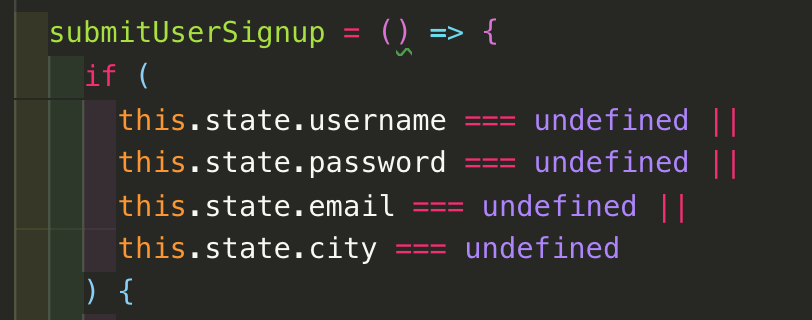
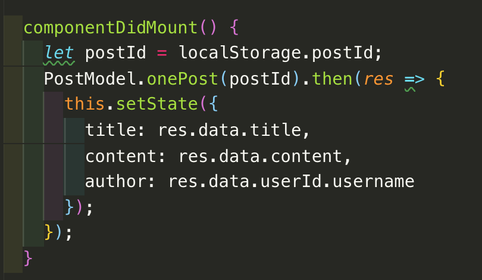

# Oasis Front End
The front end section for our application Oasis. Oasis is a travel community application where users can share tips about their favorite locations around the world. Oasis was created by Brandon Castillo, Karma Drukpa, Amberly Wang and Michael Claus. Users who are logged in can see their profile and their posts. They can edit their profile, create new posts, edit posts, and delete posts. Users can also see different cities and the posts for each specific city.

http://nameless-crag-43595.herokuapp.com/

## Back-End Section
Our backend code for this project can be found here: https://github.com/brandonmcastillo/Oasis-BackEnd

## Technologies Used
- HTML
- CSS
- Javascript
- React.js
- React Bootstrap

## Our Approach and Process
Since this project uses React.js, we decided we needed to first plan out the structure of our components and establish a baseline for how the components and data would interact wih each other. It was important to start planning our components out before we started coding so that we wouldn't run into organization problems as we started coding.
.jpg)
Once we had our basic file structure set up and added some hardcoded dummy text, we started to gradually integrate the information from the database to our front end application. We worked with the city and user entities separately, first getting them to render on the page, and then populating the pages with user posts.
 
After we had rendered everything, we started to implement the CRUD methods onto our front end application. As we worked on our application's functionality, we also paid attention to the styling of the page and structured our grids and responsiveness as we went coded. We used the project sprints as a guideline for what features we needed to include and how users should interact with them.
## Challenges and Successes
Some challenges for us were:
* User validation
* Combining React.js with Bootstrap
* City Container and Profile Container componenets

React.js proved to be the source of a lot of difficulty as we first started this project, because of the top to bottom data flow and React's separation of concerns. It is important to make sure components are independent, but as our application grew, so did the number of files and the information we had to keep track of. Component states and functions often had to be passed down and it was sometimes hard to keep track of everything.
 
Some of our wins were getting the user signed up and logged in and getting their information to render on their profile. Implementing all of our CRUD methods, and working out the bugs was also a big win. As we worked on these features, sometimes we found unnoticed bugs in previous parts of the code and we had to fix those issues first. 
 
Our team was very focused and we all communicated with each other very well. The size of our project allowed us to work more independently so communicating helped us delegate which tasks each person should complete. When someone needed help on their portion, we would pair or group program to get through the problem. Everyone contributed something to this project and we all brought our own areas of expertise to help each other.
## Unsolved Problems
* Search bar
* Refactoring/Optimization
* Some style elements

## Code Snippets

We realized that if our users submitted an empty signup form it would crash our server, so we came up with an edge case for that scenario. If any of the fields are empty then the function will break and no information will be sent to the server. We ended up resuing the same concept for other forms on our application such as logging in, creating a post, or editing a user.
 

To create the show page for posts, we needed to grab the post id and render it onto the next page. We couldn't pass the post id over to the new page, so we stored it in local storage and then grabbed it as the component mounted.
